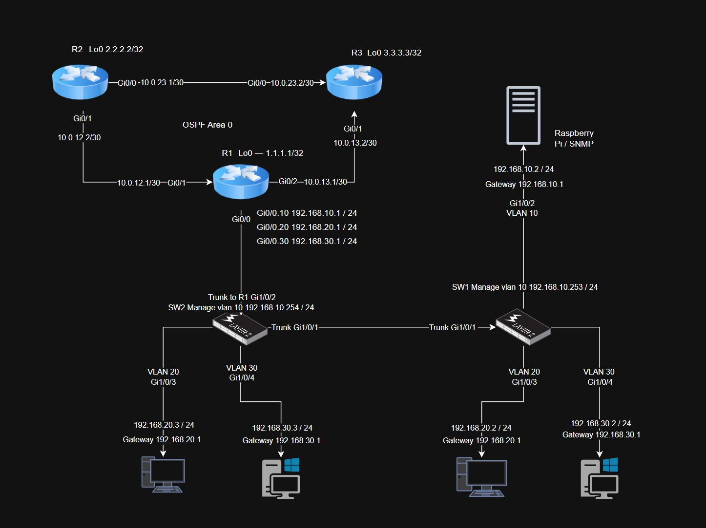

# Project 2 — OSPF Multi-Site Routing & Failover

## Overview
Configured OSPF dynamic routing across three Cisco 2911 
routers simulating a multi-site WAN network. Demonstrated 
automatic failover by pulling a WAN link and verifying 
OSPF reconvergence and traffic rerouting.

## Hardware Used
- 3x Cisco 2911 Routers
- 2x Cisco Catalyst 2960X switches (from Project 1)

## Network Topology

## OSPF Design
- Protocol: OSPFv2
- Process ID: 1
- Area: Backbone (Area 0)
- Router IDs based on loopback interfaces

## IP Addressing

### Point-to-Point WAN Links
| Link  | Interface | IP Address     |
|-------|-----------|----------------|
| R1-R2 | R1 Gi0/1  | 10.0.12.1/30   |
| R1-R2 | R2 Gi0/1  | 10.0.12.2/30   |
| R1-R3 | R1 Gi0/2  | 10.0.13.1/30   |
| R1-R3 | R3 Gi0/1  | 10.0.13.2/30   |
| R2-R3 | R2 Gi0/0  | 10.0.23.1/30   |
| R2-R3 | R3 Gi0/0  | 10.0.23.2/30   |

### Loopbacks
| Router | Interface | IP Address  |
|--------|-----------|-------------|
| R1     | Lo0       | 1.1.1.1/32  |
| R2     | Lo0       | 2.2.2.2/32  |
| R3     | Lo0       | 3.3.3.3/32  |

### VLAN Networks Advertised by R1
| VLAN | Network          |
|------|------------------|
| 10   | 192.168.10.0/24  |
| 20   | 192.168.20.0/24  |
| 30   | 192.168.30.0/24  |

## Configuration Files
- [R1 Config](r1-config.txt)
- [R2 Config](r2-config.txt)
- [R3 Config](r3-config.txt)

## Verification Commands

show ip ospf neighbor
show ip route ospf
show ip ospf interface brief
ping 2.2.2.2
ping 3.3.3.3

## Failover Test
Pulled cable between R1 and R2 while running continuous 
ping from R1 to R2 loopback (2.2.2.2). OSPF reconverged 
and rerouted traffic through R3. Connectivity restored 
within seconds.

## Troubleshooting Encountered
R1 Gi0/0 subinterfaces showed down during Project 2 
testing — switches were powered off. Interfaces came 
back up when switches were powered on. No impact on 
OSPF routing between routers.

## Results
- OSPF adjacencies established between all 3 routers
- All loopbacks and VLAN networks learned via OSPF
- Failover verified — traffic rerouted through R3 
  when R1-R2 link was pulled
- OSPF reconvergence confirmed with continuous ping

## Video Demo
https://youtu.be/DQ18TuJsH8s